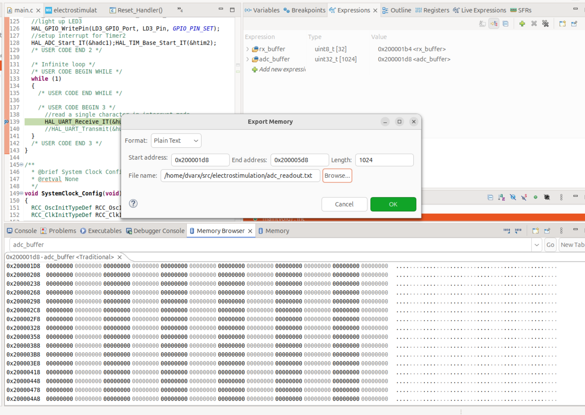

## Documentation

## Export data from STM32 CubeIDE Debugger
- Display the memory browser `Windows`->`Show View`->`Memory Browser`
- Export the data as shown below and use `plot_memory_buffer.py` to visualize the data
