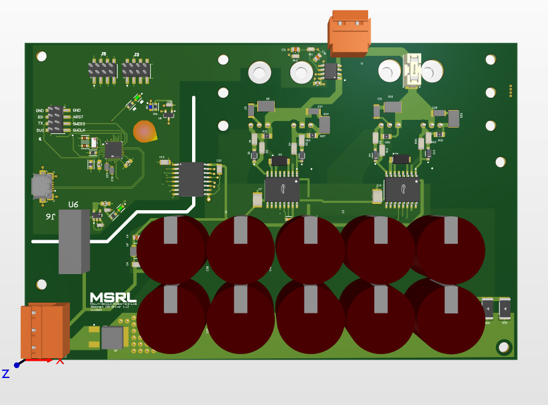
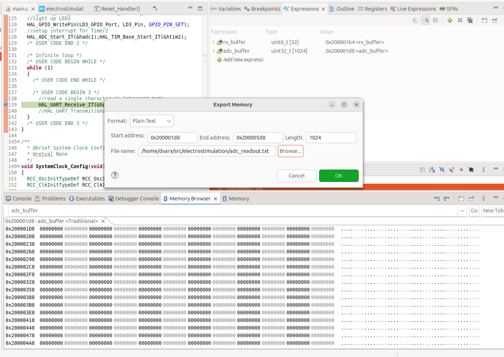

# Electrostimulation Project

This project contains the Firmware for the STM32L432KB used in the electrostimulation driver PCB. A simple script which demonstrates turning the output on and off and setting of the PWM frequency is provided in `EMDriver.py`.

  
   
  <a href="https://github.com/dvarx/irs_driver">Electrostimulation Driver</a>

## Commands

|Command Syntax|Meaning|
|----|----|
|`STRT\n`|Starts PWM output|
|`STOP\n`|Stops PWM output|
|`CNTR\0XXXXXXXX\n`| Sets the counter limit of the internal PWM counter

The resulting PWM frequency is given by $f_{PWM}=\frac{counter}{2^{24}}$.

## Autostart
To enable the output of the driver upon powerup, `#define AUTOSTART` in `main.c`.

## Export data from STM32 CubeIDE Debugger
- Display the memory browser `Windows`->`Show View`->`Memory Browser`
- Export the data as shown below and use `plot_memory_buffer.py` to visualize the data
